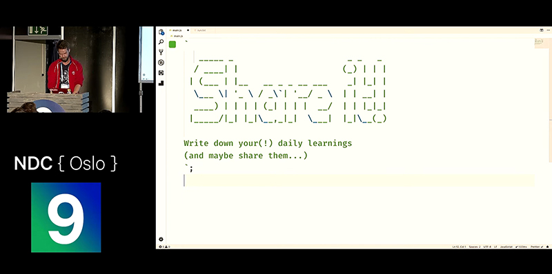

**Today I leaned**, this 3 words got stuck on my head for a couple of days after seeing a 10 minutes [presentation](https://youtu.be/kIhITzw0CG8) of **Stefan Judis** at the 2019 NDC Conference

During the presentation Stefan talks about the power of share what you learn and in his last slide the message is simple:

**Share It !!**

This message motivated me to develop a Gatsby blog where I can share small things that helped me in the past, amazing things i'm learning at the moment and maybe some tutorials on my favorite technologies.

This is my **Hello World** to the community and I hope you find something helpful for your developer journey !
